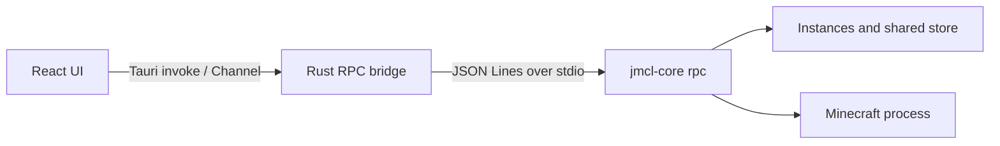

# JMCL

[English](./README.md) | 简体中文

JMCL 是一个面向 Minecraft: Java Edition 的桌面启动器。本仓库包含 JMCL 的图形界面和 Tauri 中间层；游戏安装、文件校验、Java 启动与进程监管由独立的 `jmcl-core` 完成。

项目目前处于早期开发阶段，界面、RPC 契约和发布方式仍可能调整。

## 当前功能

- 管理多个相互隔离的 Minecraft 实例
- 创建、安装、重新安装和删除实例
- 浏览正式版或测试版 Minecraft 版本
- 创建原版、Fabric、NeoForge 和 Forge 实例
- 展示文件数与字节级安装进度
- 使用 core 返回的完成标记判断实例安装状态
- 离线账户启动
- 查看游戏 stdout、stderr 和 core 诊断日志
- 浅色、深色及跟随系统主题
- 中文和英文界面
- Mojang 官方源与 BMCLAPI 下载源
- 可配置实例目录和共享制品存储目录

尚未完成的主要功能包括 Microsoft 账户、Mod/资源包/光影管理、整合包导入、Java 管理和高级启动选项。

## 技术栈

- [Tauri 2](https://tauri.app/)
- [React 19](https://react.dev/) + TypeScript
- [Vite](https://vite.dev/)
- [Tailwind CSS 4](https://tailwindcss.com/)
- [shadcn/ui](https://ui.shadcn.com/) + [Base UI](https://base-ui.com/)
- [Bun](https://bun.sh/)
- Rust、Tokio、Serde

## 架构



`jmcl-core` 以持久子进程运行。GUI 向 stdin 写入 JSON Lines 请求，并从 stdout 接收进度和终止事件。协议 v1 的单个 session 同时只处理一个请求；安装和启动等并发任务使用独立 session。

RPC 契约见 [`gui-handoff.md`](./gui-handoff.md)。

Rust transport 已与 session 层解耦，当前实现为本地子进程，后续可以增加 SSH transport，而不改变上层 RPC 和 React 接口。

## 开发环境

需要安装：

- [Bun](https://bun.sh/)
- Rust stable
- 当前平台的 [Tauri prerequisites](https://v2.tauri.app/start/prerequisites/)
- 与 `gui-handoff.md` 匹配的 `jmcl-core` 二进制

安装前端依赖：

```bash
bun install
```

### 准备 jmcl-core

开发用 core 二进制不纳入本仓库。请创建 `backend-binaries` 目录并放入当前平台的二进制：

```text
backend-binaries/
└── jmcl-core          # Windows 使用 jmcl-core.exe
```

macOS 和 Linux 上需要确保文件可执行：

```bash
chmod +x backend-binaries/jmcl-core
```

也可以通过环境变量指定其他位置：

```bash
JMCL_CORE=/absolute/path/to/jmcl-core bun run tauri dev
```

开发环境按以下顺序寻找 core：

1. 调用方显式传入的路径
2. `JMCL_CORE` 环境变量
3. 应用可执行文件附近或父目录中的 sidecar
4. 各级父目录中的 `backend-binaries/jmcl-core`

### 启动桌面应用

```bash
bun run tauri dev
```

只启动 Vite 前端：

```bash
bun run dev
```

普通浏览器环境没有 Tauri IPC，涉及 core 的功能需要在 Tauri 应用中运行。

## 构建与验证

前端类型检查和生产构建：

```bash
bun run build
```

Rust 与真实 core RPC 测试：

```bash
cargo test --manifest-path src-tauri/Cargo.toml
```

构建不附带 core 的桌面安装包：

```bash
bun run tauri build
```

构建附带当前平台 `jmcl-core` sidecar 的安装包：

```bash
bun run tauri:build:sidecar
```

sidecar 构建会把 `backend-binaries/jmcl-core` 复制为 `src-tauri/binaries/` 中带目标三元组后缀的文件，并应用 `src-tauri/tauri.sidecar.json`。如需使用其他 core 二进制，先通过 staging 脚本传入显式路径：

```bash
./scripts/prepare-sidecar.sh /absolute/path/to/jmcl-core
tauri build --config src-tauri/tauri.sidecar.json
```

`src-tauri/binaries/` 中的文件属于构建产物，不提交到 Git。正式发布需要为每个目标平台准备匹配的 `jmcl-core` sidecar；`backend-binaries/` 中的本地开发二进制同样不会提交。

## 项目结构

```text
src/
├── components/        React 业务组件和 shadcn/ui 组件
├── lib/               RPC、任务、设置、类型和启动器状态
├── pages/             实例与设置页面
├── App.tsx            应用外壳
└── App.css            Tailwind 入口和主题变量

src-tauri/
├── src/transport.rs   本地进程与未来远程 transport 边界
├── src/session.rs     JSON Lines RPC 会话
├── src/pool.rs        多会话生命周期管理
├── src/lib.rs         Tauri commands 与事件桥接
└── tests/             真实 jmcl-core 冒烟测试
```

## 下载源

选择 BMCLAPI 时，JMCL 会在界面中显示服务提供方信息。请遵守 BMCLAPI 及其他上游服务的使用条款。代理设置通过 `HTTP_PROXY`、`HTTPS_PROXY` 和 `ALL_PROXY` 环境变量传递给 core。

## 许可证

本仓库以 [MIT License](./LICENSE) 发布。

`jmcl-core` 是独立组件，其源码和二进制可能适用各自的许可证与通知文件。

## 免责声明

JMCL 不是 Mojang Studios 或 Microsoft 的官方产品，也未获得其认可或关联。Minecraft 是 Microsoft 旗下相关主体的商标。
