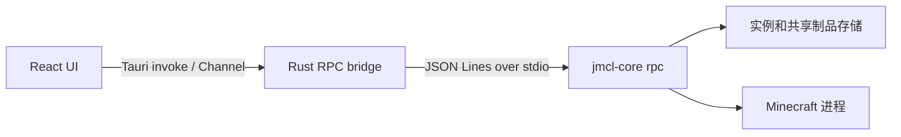

# JMCL

[English](./README.md) | 简体中文

JMCL 是 Minecraft: Java Edition 的桌面启动器。本仓库包含 React/TypeScript GUI 和 Tauri bridge；安装、校验、Java 启动准备及进程监管由独立的 `jmcl-core` 负责。权威 RPC 契约见 [`gui-handoff.md`](./gui-handoff.md)，core 组件见 [JMCLCore 仓库](https://github.com/678mjoe/JMCLCore)。

## 当前范围

当前 GUI 支持：

- 多个相互隔离的原版、Fabric、NeoForge 和 Forge 实例；
- 实例创建、安装、重新安装、校验、删除和启动；
- 离线启动和 Microsoft 设备代码账户（刷新凭据保存在原生 keychain）；
- 通过 Modrinth 搜索和管理 Mod、资源包、光影；
- 本地 Java 检测及托管 Java 运行时安装/删除；
- 世界列表、元数据、重命名、复制、删除、导入/导出、备份/恢复；
- 安装进度以及 stdout、stderr、core 诊断日志；
- 中英文界面、主题、官方/BMCLAPI 源和可配置目录。

服务器 GUI 和 SSH transport 尚未实现。客户端数据包、完整整合包/CurseForge 支持及高级启动选项也不在当前范围内。mock 有稳定的列表错误场景，但没有声称提供安装失败或超出下文所述确定性事件的安装进度场景切换。

## 技术栈与开发依赖

- [Tauri 2](https://tauri.app/) 以及 Rust、Tokio、Serde
- [React 19](https://react.dev/) 与 TypeScript
- [Vite](https://vite.dev/)、[Tailwind CSS 4](https://tailwindcss.com/)
- [shadcn/ui](https://ui.shadcn.com/)、[Base UI](https://base-ui.com/) 和 Lucide
- [Bun](https://bun.sh/)，用于前端依赖和测试

安装开发依赖：

```bash
bun install --frozen-lockfile
```

## 架构



`jmcl-core` 以持久子进程运行。GUI 发送 JSON Lines 请求并接收进度和终止事件。协议 v1 的单个 session 同时只处理一个请求；安装和启动使用独立 session。按实例的协调器禁止同一实例的 mutation 并发，同时允许不同实例并行。

RPC 契约见 [`gui-handoff.md`](./gui-handoff.md)。Rust transport 与 session 层解耦，未来可以增加远程 transport 而不改变 React RPC 接口。

## 开发环境与 core 查找顺序

需要 Bun、Rust stable、目标平台的 [Tauri prerequisites](https://v2.tauri.app/start/prerequisites/) 以及匹配的 `jmcl-core` 二进制。

开发时，`backend-binaries` 是输入目录，不是 staging/输出目录：

```text
backend-binaries/
└── jmcl-core          # Windows 使用 jmcl-core.exe
```

macOS 和 Linux 上可用 `chmod +x backend-binaries/jmcl-core` 设置可执行权限，也可以指定其他二进制：

```bash
JMCL_CORE=/absolute/path/to/jmcl-core bun run tauri dev
```

Rust transport 按以下顺序查找 core：

1. 调用方显式传入的路径；
2. `JMCL_CORE` 环境变量；
3. 仅 release 构建检查应用可执行文件旁边或其父目录中的打包 sidecar；
4. debug/development 构建查找各级父目录中的 `backend-binaries/jmcl-core`。release 构建找不到打包 sidecar 时也会回退到这些父目录中的 `backend-binaries`。

## 浏览器 mock 开发

普通浏览器没有 Tauri IPC。需要确定性浏览和交互时，显式启动开发态 mock：

```bash
bun run dev:mock --host 127.0.0.1
```

mock 场景在初始化时选择，修改后重启 Vite 即可复位：

- `default`（默认）：5 个实例、账户/托管 Java/内容/世界 fixture，以及进度和交错日志；
- `empty`：实例、账户、托管 Java、内容和世界均为空；
- `errors`：`core.version` 和 `instance.list` 确定性返回 `MOCK_SCENARIO_ERROR`。

可以用 URL 查询参数或环境变量选择：

```text
http://127.0.0.1:1420/?jmclMockScenario=empty
VITE_JMCL_MOCK_SCENARIO=errors bun run dev:mock --host 127.0.0.1
```

mock mutation 在内存中生效，包括账户保存/删除、托管 Java 安装/删除、内容操作、实例操作和世界操作。测试会调用 fixture reset API，因此场景之间不会共享污染状态。mock 凭据和 Microsoft 登录数据均为合成数据，不会访问真实 keychain。

mock 仅限开发/测试。Vite production build 不会因为生产全局变量而进入 mock；普通 `bun run dev` 和桌面构建使用真实 Tauri transport。

## 桌面开发与打包

启动桌面应用：

```bash
bun run tauri dev
```

当前默认 Tauri config 已声明 `bundle.externalBin: ["binaries/jmcl-core"]`。因此使用默认 config 的桌面正式构建需要先准备 sidecar：

```bash
bun run sidecar:prepare
bun run tauri build
```

`backend-binaries/` 中的 core 是开发输入；`src-tauri/binaries/` 中带目标三元组后缀的文件是 Tauri 消费的 staging 产物，不提交到 Git。便捷命令会使用 sidecar config 执行这两步：

```bash
bun run tauri:build:sidecar
```

普通浏览器 Vite 测试不能验证原生窗口、文件系统、keychain、进程或打包 sidecar。本 Raspberry Pi/headless 工作区可以运行 Vite、Bun 测试、TypeScript、Rust 格式检查和 core 侧测试；完整 Tauri 原生验收应在具备对应 prerequisites 的 macOS 或 Windows 上，使用匹配的 core 二进制完成。

## 命令与验证

```bash
bun install --frozen-lockfile
bun run dev
bun run dev:mock
bun run test
bun run build
cargo fmt --manifest-path src-tauri/Cargo.toml --all -- --check
```

Rust 冒烟测试在可用时使用 `backend-binaries` 中匹配的 core：

```bash
cargo test --manifest-path src-tauri/Cargo.toml
```

## 项目结构

```text
src/
├── components/        React 业务组件和共享 UI
├── lib/               RPC、mock、native adapters、任务、设置和类型
├── pages/             实例、Java、内容、世界和设置页面
├── App.tsx            应用外壳
└── App.css            Tailwind 入口和主题变量

src-tauri/
├── src/transport.rs   本地进程与 sidecar/core 查找边界
├── src/session.rs     JSON Lines RPC 会话
├── src/pool.rs        多会话生命周期管理
├── src/lib.rs         Tauri commands 与事件桥接
└── tests/             针对真实 jmcl-core 的测试
```

## 下载源与代理

选择 BMCLAPI 时，JMCL 会显示服务提供方信息。请遵守 BMCLAPI 及其他上游服务的使用条款。代理设置通过 `HTTP_PROXY`、`HTTPS_PROXY` 和 `ALL_PROXY` 环境变量传递给 core。

## 许可证与免责声明

本仓库以 [MIT License](./LICENSE) 发布。`jmcl-core` 是独立组件，可能有自己的许可证和通知文件。

JMCL 不是 Mojang Studios 或 Microsoft 的官方产品，也未获得其认可或关联。Minecraft 是 Microsoft 旗下相关主体的商标。
