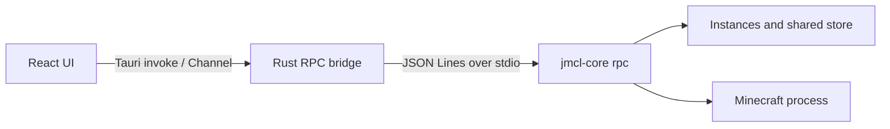

# JMCL

English | [简体中文](./README-zh_CN.md)

JMCL is a desktop launcher for Minecraft: Java Edition. This repository contains the React/TypeScript GUI and its Tauri bridge; the separate `jmcl-core` owns installation, verification, Java launch preparation, and process supervision. The authoritative RPC contract is [`gui-handoff.md`](./gui-handoff.md). See the [JMCLCore repository](https://github.com/678mjoe/JMCLCore) for the core component.

## Current scope

The GUI currently supports:

- multiple isolated vanilla, Fabric, NeoForge, and Forge instances;
- create, install, reinstall, validate, delete, and launch flows;
- offline launch and Microsoft device-code accounts (refresh credentials stay in the native keychain);
- Modrinth search and management for mods, resource packs, and shader packs;
- local Java detection and managed Java runtime install/remove;
- world listing, metadata, rename, duplicate, delete, import/export, backup, and restore;
- installation progress plus stdout, stderr, and core diagnostics;
- Chinese/English UI, themes, official/BMCLAPI sources, and configurable directories.

The server GUI and SSH transport are not implemented yet. Client data packs, full modpack/CurseForge support, and advanced launch options are also outside the current scope. The mock deliberately covers stable list errors, but does not claim install-failure or install-progress scenario switching beyond the deterministic events described below.

## Technology stack and dependencies

- [Tauri 2](https://tauri.app/) and Rust, Tokio, Serde
- [React 19](https://react.dev/) and TypeScript
- [Vite](https://vite.dev/), [Tailwind CSS 4](https://tailwindcss.com/)
- [shadcn/ui](https://ui.shadcn.com/), [Base UI](https://base-ui.com/), and Lucide
- [Bun](https://bun.sh/) for frontend dependencies and tests

Install the development dependencies with:

```bash
bun install --frozen-lockfile
```

## Architecture



`jmcl-core` runs as a persistent child process. The GUI sends JSON Lines requests and receives progress and terminal events. A protocol v1 session handles one request at a time; installation and launch use dedicated sessions. The instance coordinator prevents concurrent mutations of one instance while allowing different instances to proceed in parallel.

See [`gui-handoff.md`](./gui-handoff.md) for the RPC contract. The Rust transport is separated from the session layer, leaving room for a future remote transport without changing the React RPC surface.

## Development requirements and core lookup

You need Bun, Rust stable, the [Tauri prerequisites](https://v2.tauri.app/start/prerequisites/) for the target platform, and a compatible `jmcl-core` binary.

For development, `backend-binaries` is an input directory and is not a staging/output directory:

```text
backend-binaries/
└── jmcl-core          # Use jmcl-core.exe on Windows
```

On macOS and Linux, make it executable with `chmod +x backend-binaries/jmcl-core`, or select another binary:

```bash
JMCL_CORE=/absolute/path/to/jmcl-core bun run tauri dev
```

The Rust transport looks for the core in this order:

1. an explicitly supplied path;
2. the `JMCL_CORE` environment variable;
3. in release builds only, a bundled sidecar next to the application executable or one of its parent directories;
4. in debug/development builds, `backend-binaries/jmcl-core` under the executable's parent directories. A release build also falls back to those ancestor `backend-binaries` directories when no bundled sidecar is found.

## Browser mock development

The regular browser has no Tauri IPC. For deterministic browser development, start the explicit development mock:

```bash
bun run dev:mock --host 127.0.0.1
```

The mock scenario is selected at initialization and can be reset by restarting Vite:

- `default` (the default): five instances, account/runtime/content/world fixtures, progress and mixed logs;
- `empty`: empty instances, accounts, managed Java, content, and worlds;
- `errors`: deterministic `MOCK_SCENARIO_ERROR` for `core.version` and `instance.list`.

Use either a query parameter or an environment variable:

```text
http://127.0.0.1:1420/?jmclMockScenario=empty
VITE_JMCL_MOCK_SCENARIO=errors bun run dev:mock --host 127.0.0.1
```

Fixture mutations are in memory and include account save/delete, managed Java install/remove, content operations, instance operations, and world operations. Tests call the fixture reset API so state is not shared between scenarios. Mock credentials and Microsoft login data are synthetic and never access a real keychain.

The mock is development/test-only. The Vite production build cannot enter it through a production global variable; normal `bun run dev` and desktop builds use the real Tauri transport.

## Desktop development and packaging

Run the desktop application with:

```bash
bun run tauri dev
```

The default Tauri config currently declares `bundle.externalBin: ["binaries/jmcl-core"]`. Therefore a desktop package built with the default config requires a staged sidecar. Stage the development input and build it with:

```bash
bun run sidecar:prepare
bun run tauri build
```

The `backend-binaries/` binary is the development input. The target-triple-named file produced under `src-tauri/binaries/` is the staging artifact consumed by Tauri and is not committed. The convenience command runs both steps with the sidecar config:

```bash
bun run tauri:build:sidecar
```

Normal browser Vite tests cannot verify native window, filesystem, keychain, process, or packaged-sidecar behavior. This Raspberry Pi/headless workspace can run Vite, Bun tests, TypeScript, Rust formatting, and core-side tests; full native Tauri acceptance belongs on macOS or Windows with matching prerequisites and a matching core binary.

## Commands and verification

```bash
bun install --frozen-lockfile
bun run dev
bun run dev:mock
bun run test
bun run build
cargo fmt --manifest-path src-tauri/Cargo.toml --all -- --check
```

The Rust smoke tests use the compatible core in `backend-binaries` when available:

```bash
cargo test --manifest-path src-tauri/Cargo.toml
```

## Project structure

```text
src/
├── components/        React business components and shared UI
├── lib/               RPC, mock, native adapters, tasks, settings, and types
├── pages/             Instance, Java, content, world, and settings pages
├── App.tsx            Application shell
└── App.css            Tailwind entry point and theme variables

src-tauri/
├── src/transport.rs   Local process and sidecar/core lookup boundary
├── src/session.rs     JSON Lines RPC session
├── src/pool.rs        Multi-session lifecycle management
├── src/lib.rs         Tauri commands and event bridge
└── tests/             Tests against a real jmcl-core binary
```

## Download sources and proxy

When BMCLAPI is selected, JMCL displays the service provider attribution. Follow BMCLAPI and upstream service terms. Proxy configuration is passed to the core through `HTTP_PROXY`, `HTTPS_PROXY`, and `ALL_PROXY`.

## License and disclaimer

This repository is distributed under the [MIT License](./LICENSE). `jmcl-core` is a separate component and may have its own licenses and notices.

JMCL is not an official Mojang Studios or Microsoft product and is not endorsed by or affiliated with either company. Minecraft is a trademark of the relevant Microsoft entities.
