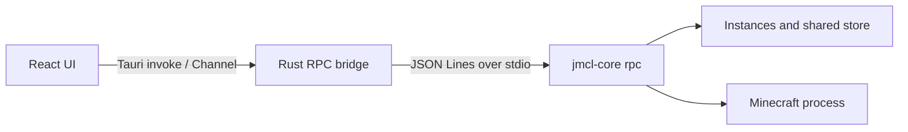

# JMCL

English | [简体中文](./README-zh_CN.md)

JMCL is a desktop launcher for Minecraft: Java Edition. This repository contains the JMCL graphical interface and its Tauri bridge. Game installation, file verification, Java launch preparation, and process supervision are handled by the separate `jmcl-core` component.

The project is in early development. The UI, RPC contract, and release process may still change.

## Current Features

- Manage multiple isolated Minecraft instances
- Create, install, reinstall, and delete instances
- Browse release or test Minecraft versions
- Create vanilla, Fabric, NeoForge, and Forge instances
- Display file-count and byte-level installation progress
- Use completion markers reported by the core as the authoritative installation state
- Launch with an offline account
- View game stdout, stderr, and core diagnostics
- Light, dark, and system themes
- Chinese and English interfaces
- Mojang official and BMCLAPI download sources
- Configurable instance and shared artifact-store directories

Major features not yet complete include Microsoft accounts, mod/resource-pack/shader-pack management, modpack import, Java management, and advanced launch options.

## Technology Stack

- [Tauri 2](https://tauri.app/)
- [React 19](https://react.dev/) and TypeScript
- [Vite](https://vite.dev/)
- [Tailwind CSS 4](https://tailwindcss.com/)
- [shadcn/ui](https://ui.shadcn.com/) and [Base UI](https://base-ui.com/)
- [Bun](https://bun.sh/)
- Rust, Tokio, and Serde

## Architecture



`jmcl-core` runs as a persistent child process. The GUI writes JSON Lines requests to stdin and receives progress and terminal events from stdout. A protocol v1 session handles one request at a time; concurrent operations such as installation and launch use separate sessions.

See [`gui-handoff.md`](./gui-handoff.md) for the RPC contract.

The Rust transport is separated from the session layer. The current implementation uses a local child process, while a future SSH transport can be added without changing the RPC or React layers.

## Development Requirements

Install the following:

- [Bun](https://bun.sh/)
- Rust stable
- The [Tauri prerequisites](https://v2.tauri.app/start/prerequisites/) for your platform
- A `jmcl-core` binary compatible with `gui-handoff.md`

Install frontend dependencies:

```bash
bun install
```

### Prepare jmcl-core

Development core binaries are not committed to this repository. Create `backend-binaries` and place the binary for your platform inside it:

```text
backend-binaries/
└── jmcl-core          # Use jmcl-core.exe on Windows
```

On macOS and Linux, make the binary executable:

```bash
chmod +x backend-binaries/jmcl-core
```

You may specify a different location with an environment variable:

```bash
JMCL_CORE=/absolute/path/to/jmcl-core bun run tauri dev
```

The development build resolves the core in this order:

1. A path explicitly supplied by the caller
2. The `JMCL_CORE` environment variable
3. A sidecar next to the application executable or one of its parent directories
4. `backend-binaries/jmcl-core` under the executable's parent directories

### Run the Desktop Application

```bash
bun run tauri dev
```

Run only the Vite frontend:

```bash
bun run dev
```

A regular browser does not provide Tauri IPC, so features that require the core must run inside the Tauri application.

## Build and Verification

Run the TypeScript check and production frontend build:

```bash
bun run build
```

Run Rust and real-core RPC tests:

```bash
cargo test --manifest-path src-tauri/Cargo.toml
```

Build desktop packages:

```bash
bun run tauri build
```

A release must provide a matching `jmcl-core` sidecar for every target platform. Local binaries under `backend-binaries/` are not committed to Git.

## Project Structure

```text
src/
├── components/        React business components and shadcn/ui components
├── lib/               RPC, tasks, settings, types, and launcher state
├── pages/             Instance and settings pages
├── App.tsx            Application shell
└── App.css            Tailwind entry point and theme variables

src-tauri/
├── src/transport.rs   Local process and future remote transport boundary
├── src/session.rs     JSON Lines RPC session
├── src/pool.rs        Multi-session lifecycle management
├── src/lib.rs         Tauri commands and event bridge
└── tests/             Tests against a real jmcl-core binary
```

## Download Sources

When BMCLAPI is selected, JMCL displays the service provider attribution in the interface. Follow the terms of BMCLAPI and other upstream services. Proxy configuration is passed to the core through the `HTTP_PROXY`, `HTTPS_PROXY`, and `ALL_PROXY` environment variables.

## License

This repository is distributed under the [MIT License](./LICENSE).

`jmcl-core` is a separate component. Its source and binaries may be governed by their own licenses and notices.

## Disclaimer

JMCL is not an official Mojang Studios or Microsoft product and is not endorsed by or affiliated with either company. Minecraft is a trademark of the relevant Microsoft entities.
